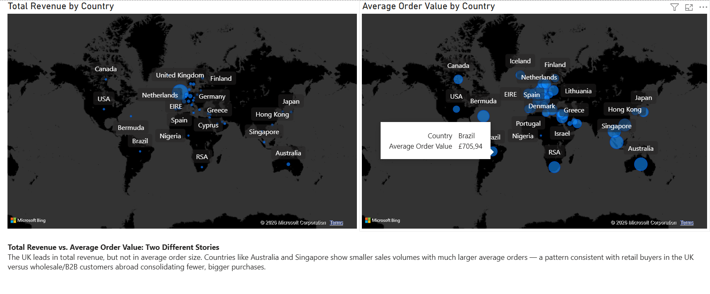

## Python: Data Cleaning, RFM Segmentation, Cohort Analysis & Forecasting

### Overview
The core analysis pipeline (Jupyter Notebook) covers end-to-end data cleaning of ~1M raw transaction rows, customer segmentation (RFM), retention analysis (cohorts), interactive visualizations, and a revenue forecasting model.

### 1. Data Cleaning
Starting from the raw Online Retail II dataset, the following issues were identified and resolved:
- **Full duplicate rows** — removed (technical export error, not repeat purchases)
- **Warehouse adjustment records** (negative quantity, no 'C' invoice prefix, Price = 0) — removed
- **Bad debt entries** ('A'-prefixed invoices, negative prices) — removed
- **Service StockCodes** (postage, bank charges, Amazon/CRUK fees, manual adjustments) — identified via non-numeric codes and removed, while preserving legitimate letter-coded products (e.g. `PADS`)
- Data types fixed (`InvoiceDate` converted to datetime)

**Result:** 1,024,239 clean rows retained, with all major data quality issues resolved and documented.

### 2. RFM Segmentation
Customers were segmented using Recency, Frequency, and Monetary metrics (quartile-based scoring), applied only to completed orders with a valid Customer ID.

| Segment | Customers |
|---|---|
| Lost | 1,994 |
| Champions | 1,746 |
| New customers | 919 |
| Other | 610 |
| At Risk | 587 |

**Total: 5,856 customers** across 5 segments.

### 3. Cohort Retention Analysis
Customers were grouped by their first purchase month (cohort), and a retention matrix was built showing the percentage of each cohort still active in subsequent months — visualized as an interactive heatmap.

### 4. Visualizations (Plotly)
- **Retention heatmap** — cohort month × months since first purchase
- **Recency vs. Monetary scatter** (log scale, colored by segment, sized by frequency)
- **Customer count by RFM segment** (bar chart)

### 5. Revenue Forecast
- **Baseline model:** linear regression on month index alone → R² ≈ 0.14 (fails to capture seasonal spikes, e.g. the pre-holiday November peak)
- **Improved model:** added one-hot encoded calendar month as seasonal dummy variables → R² ≈ 0.97
- **Caveat:** with only 24 monthly observations and 12 features, this carries a real overfitting risk — there's no held-out validation set to confirm true predictive accuracy on unseen future months. Forecasts for Dec 2011–Feb 2012 were sanity-checked against the same months in prior years rather than treated as fully reliable predictions.

### Output
Cleaned dataset exported as `df_clean_export.csv` for downstream SQL, Excel, and Power BI analysis.


## SQL Analysis: Products & Basket

Performed in MySQL Workbench on the cleaned dataset exported from the Python 
pipeline (`online_retail_clean_py`, 1,024,239 rows).

### Setup notes
- Loaded via `LOAD DATA INFILE`, converting empty CustomerID strings to real SQL `NULL`
- Added an index on `Invoice` to support join performance
- Hit `net_read_timeout`/`net_write_timeout` disconnects (default 30s) on the 
  self-join query below — resolved via `SET GLOBAL net_read_timeout = 600; 
  SET GLOBAL net_write_timeout = 600;`

### 1. Top 10 products by revenue

| StockCode | Description | Total Revenue |
|---|---|---|
| 22423 | REGENCY CAKESTAND 3 TIER | 314,045.02 |
| 85123A | WHITE HANGING HEART T-LIGHT HOLDER | 251,603.12 |
| 47566 | PARTY BUNTING | 147,079.73 |
| 85099B | JUMBO BAG RED RETROSPOT | 145,946.05 |
| 84879 | ASSORTED COLOUR BIRD ORNAMENT | 128,550.42 |
| 22086 | PAPER CHAIN KIT 50'S CHRISTMAS | 116,298.59 |
| 79321 | CHILLI LIGHTS | 79,905.13 |
| 84347 | ROTATING SILVER ANGELS T-LIGHT HLDR | 70,969.95 |
| 85099F | JUMBO BAG STRAWBERRY | 68,489.89 |
| 23084 | RABBIT NIGHT LIGHT | 66,661.63 |

**Insight:** decorative/gift items dominate the top of the revenue ranking — 
consistent with this being a UK-based gift and decor retailer.

### 2. Market basket analysis (top 10 co-purchased product pairs)

| Product A | Product B | Times bought together |
|---|---|---|
| 22386 | 85099B | 1,492 |
| 21931 | 85099B | 1,378 |
| 21733 | 85123A | 1,340 |
| 20725 | 20727 | 1,273 |
| 21212 | 84991 | 1,262 |
| 85099B | 85099F | 1,246 |
| 20725 | 22383 | 1,225 |
| 20725 | 22384 | 1,218 |
| 21231 | 21232 | 1,204 |
| 22411 | 85099B | 1,199 |

**Insight:** `85099B` (JUMBO BAG RED RETROSPOT, also #4 by revenue) appears in 
four of the top 10 pairs. This likely reflects its high standalone popularity 
rather than a unique product affinity — raw co-occurrence count doesn't 
control for how often each item appears on its own. A Lift-based metric 
(comparing observed vs. expected co-occurrence under independence) would be 
the natural next step to distinguish true affinity from base popularity.

### 3. Top 10 products by cancellation rate

| StockCode | Total Orders | Cancels | Cancel Rate |
|---|---|---|---|
| 79323B | 109 | 51 | 46.8% |
| 79323GR | 120 | 37 | 30.8% |
| 84770 | 23 | 7 | 30.4% |
| 23064 | 33 | 10 | 30.3% |
| 79323G | 87 | 25 | 28.7% |
| 84816 | 28 | 8 | 28.6% |
| 79323S | 78 | 22 | 28.2% |
| 79323W | 476 | 126 | 26.5% |
| 79323LP | 230 | 60 | 26.1% |
| 79323P | 352 | 86 | 24.4% |

**Insight:** 8 of the top 10 products belong to a single line — CHERRY LIGHTS 
(StockCode prefix `79323`, one code per color variant). Investigating further 
(query 7) revealed inconsistent `Description` values for the same StockCode 
across rows — duplicates with different spacing and even empty descriptions 
for some codes (e.g. `79323G`, `79323W`). This suggests catalog data 
inconsistency as a plausible contributing factor to the elevated cancellation 
rate, rather than necessarily a product defect.


## Power BI: Geographic Analysis

### Overview
Geographic distribution of sales was analyzed using Power BI Desktop, based on the cleaned dataset (`df_clean_export.csv`) exported from the Python pipeline. Two map visuals were built to compare total revenue against average order value across countries, revealing distinct customer behavior patterns by market.

### Measures (DAX)

```dax
Total Price = SUMX(df_clean_export, df_clean_export[Price] * df_clean_export[Quantity])

Average Order Value = [Total Price] / DISTINCTCOUNT(df_clean_export[Invoice])
```

### Visuals
- **Total Revenue by Country** — bubble map sized by total revenue per country
- **Average Order Value by Country** — bubble map sized by average order value per country

| Metric | Top Countries |
|---|---|
| Total Revenue | United Kingdom (dominant), followed by Netherlands, EIRE, Germany |
| Average Order Value | Australia, Singapore, Brazil, Netherlands |

### Key Insight
The UK leads by far in total revenue, but not in average order size. Countries like Australia and Singapore show smaller sales volumes with much larger average orders — a pattern consistent with retail buyers in the UK versus wholesale/B2B customers abroad consolidating fewer, bigger purchases.

### Screenshot



## Excel: Temporal Sales Analysis

### Overview
A day-of-week × hour-of-day pivot table was built in Excel to explore when transactions happen most, using `SUMIFS`/PivotTable on the cleaned export. A heatmap conditional formatting layer was applied on top to visually surface patterns.

### Methodology
- Rows: day of week (1–7)
- Columns: hour of day (6:00–21:00)
- Values: sum of `TotalPrice`
- Conditional formatting (color scale) applied to highlight peak activity cells

### Key Findings

**1. The store doesn't operate on Sundays**
Day 7 (Sunday) shows only a handful of transactions (~9,800 in total revenue) compared to 1.4M–3.9M for every other day — this day was excluded from further temporal analysis to avoid skewing averages.

**2. Monday and Tuesday peak later than the rest of the week**
While Wednesday through Saturday all peak at 12:00, Monday and Tuesday's busiest hour is 13:00 — a one-hour lag behind the rest of the working week.

**3. Monday has a compressed active window**
Monday's revenue is concentrated in a narrower band of hours (9:00–17:00), while other weekdays show activity spread across a wider range, extending into the evening (up to 18:00–20:00).

### Screenshot


